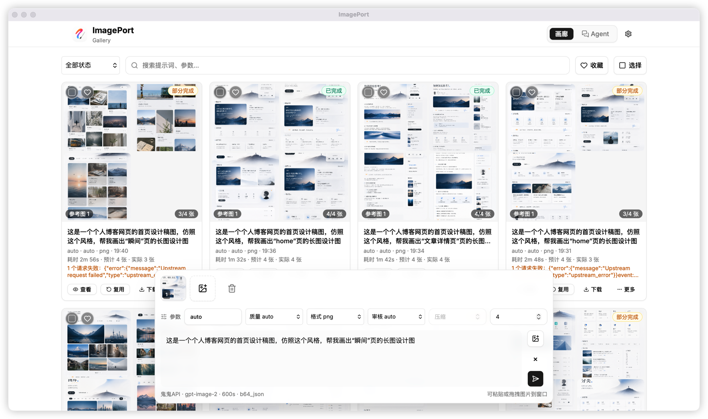
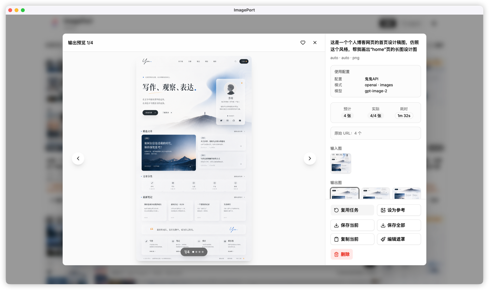
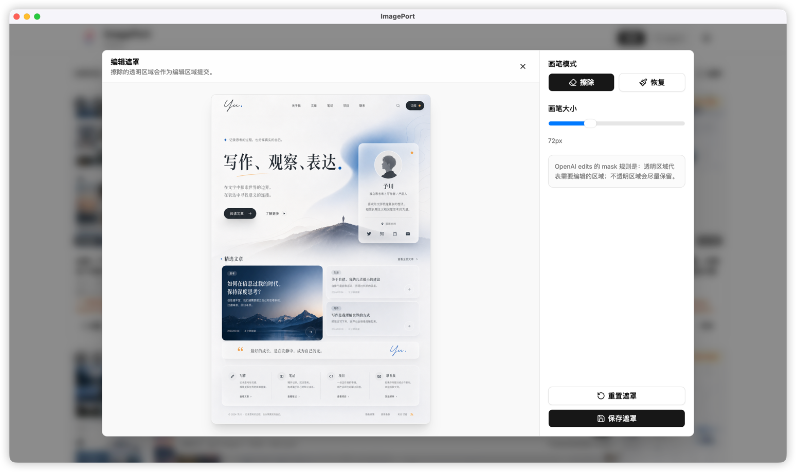
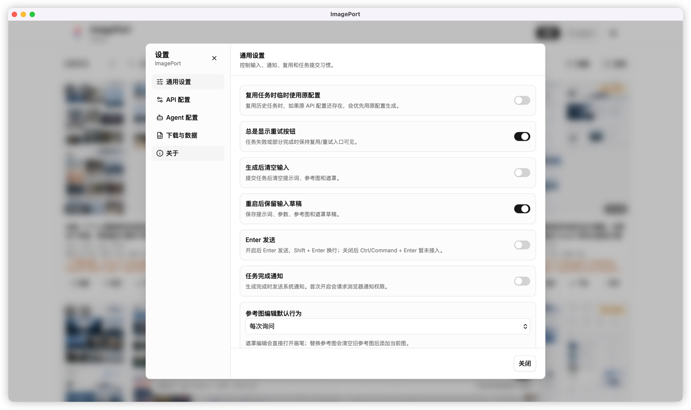
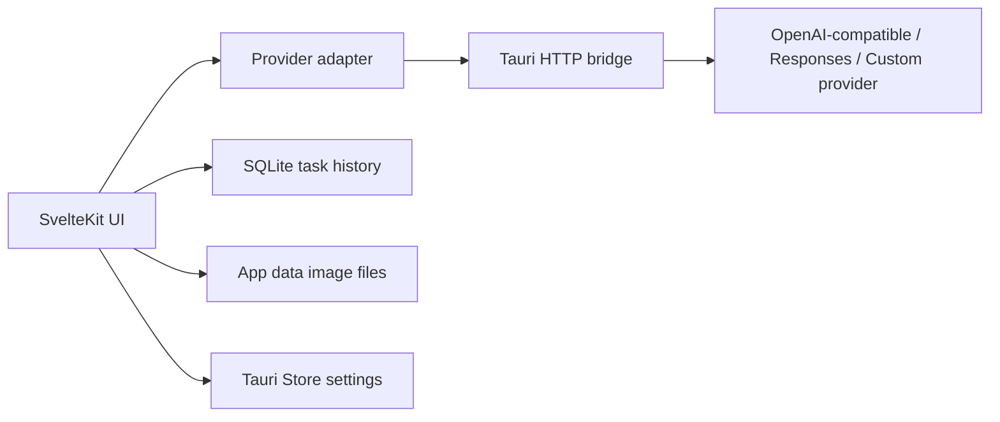

<div align="center">
  

# ImagePort

桌面端 AI 图片生成与编辑工作台。

把参考图、蒙版、生成历史、Agent 对话和本地备份放进一个更稳定的 Tauri 应用里，让 OpenAI-compatible 图片工作流不再受浏览器 CORS 和本地存储限制影响。


</div>

---

## Highlights

| 能力 | 说明 |
| --- | --- |
| Gallery 生图与改图 | 支持 OpenAI-compatible Images API、Responses API，以及通过 manifest 接入的自定义服务商。 |
| 参考图与蒙版 | 输入区可加入多张参考图，内置 mask 编辑器，适合反复迭代局部修改。 |
| Agent 模式 | 基于 Responses API 的多轮创作流，支持会话、工具调用预算、partial images、停止、重试和继续。 |
| 本地历史 | 任务记录、输入图、输出图、mask、partial images 和设置都落在本机。 |
| 收藏与批量管理 | 支持收藏集合、集合筛选、批量下载、批量删除，以及 Lightbox 大图查看。 |
| 完整备份 | 支持 ZIP 备份与恢复，避免把大图直接塞进大型 JSON。 |

## Preview

<div align="center">
  
  <br>
  <sub>Gallery workspace</sub>
</div>

<details>
<summary><strong>更多截图</strong></summary>
<br>

<div align="center">
  
  <br>
  <sub>输出预览与快捷操作</sub>
</div>

<br>

<div align="center">
  
  <br>
  <sub>参考图遮罩编辑器</sub>
</div>

<br>

<div align="center">
  
  <br>
  <sub>应用设置</sub>
</div>

</details>

## Tech Stack

| 层 | 技术 |
| --- | --- |
| 桌面容器 | Tauri 2 |
| 前端 | SvelteKit 2, Svelte 5 |
| UI | shadcn-svelte, bits-ui, Tailwind CSS 4 |
| 本地数据 | SQLite via `@tauri-apps/plugin-sql`, Tauri Store, FS |
| 原生能力 | Dialog, Clipboard Manager, Rust `reqwest` HTTP bridge |

## How It Works



前端负责 Gallery、Agent、设置、收藏与交互状态；Tauri 后端负责代理 HTTP 请求、流式响应和取消请求；本地 SQLite、Store 与应用数据目录共同保存长期历史。

## Quick Start

需要先安装：

- Bun
- Rust
- Tauri 2 对应平台依赖

安装依赖：

```bash
bun install
```

启动 Web 开发服务器：

```bash
bun run dev
```

启动桌面端：

```bash
bun run tauri dev
```

生产构建：

```bash
bun run tauri build
```

## Common Commands

| 命令 | 用途 |
| --- | --- |
| `bun test` | 运行前端与领域逻辑测试。 |
| `bun run check` | 运行 Svelte 类型与组件检查。 |
| `bun run build` | 构建静态前端产物。 |
| `cd src-tauri && cargo check` | 检查 Rust/Tauri 后端。 |
| `bun run tauri dev` | 启动桌面开发模式。 |
| `bun run tauri build` | 打包桌面应用。 |

## Project Layout

```text
ImagePort-Desktop/
  src/
    lib/api/          Provider adapter、OpenAI-compatible、Responses/Agent runner
    lib/components/   Gallery、Settings、Lightbox、Mask editor、品牌组件
    lib/domain/       纯业务模型、设置归一化、下载、收藏、备份、任务历史
    lib/storage/      SQLite、Store、FS 图片文件、剪贴板、下载
    lib/tauri/        前端 Tauri command wrapper
    routes/           SvelteKit 页面入口
  src-tauri/
    capabilities/     Tauri 权限配置
    src/commands/     Tauri commands
    src/services/     Rust HTTP client、streaming、cancellation
  static/brand/       ImagePort logo 与图标草案
  docs/               发布检查清单等项目文档
```

## API Profiles

在应用设置中创建 API Profile：

| Profile | 适用场景 |
| --- | --- |
| OpenAI Images | 常规 `/v1/images/generations` 与 `/v1/images/edits`。 |
| OpenAI Responses | Agent 模式，以及 Gallery 的 Responses 生图/改图路径。 |
| Custom Provider | 通过 JSON manifest 描述提交、轮询和结果解析路径。 |

API Key 保存在本地 Tauri Store 中。导出设置时默认不包含 API Key。

## Local Data

ImagePort 的数据默认保存在本机：

| 数据 | 存储位置 |
| --- | --- |
| 任务记录与 Agent 会话 | SQLite |
| 输出图、缩略图、输入图、mask、partial images | App data 图片目录 |
| 应用设置与输入草稿 | Tauri Store |

历史数据优先级最高：应用不会在启动时自动清理历史图片，清理动作必须由用户确认。

## Acknowledgements

ImagePort 的桌面端工作流灵感来自 [gpt_image_playground](https://github.com/CookSleep/gpt_image_playground)。感谢这个 Web 端项目在 Gallery 生图、参考图、蒙版编辑和 Agent 创作体验上的探索；ImagePort 在此基础上面向桌面端重新组织了应用结构，并重点补上跨域请求、本地大图持久化和长期历史管理。

## Release

发布前至少运行：

```bash
bun test
bun run check
bun run build
cd src-tauri && cargo check
```

更多手动检查见 [release-checklist.md](docs/release-checklist.md)。

GitHub Release 自动打包由 `.github/workflows/release.yml` 负责。创建 tag 并发布 Release 后，workflow 会在 macOS、Windows 和 Linux 上分别运行 `tauri build`，并把安装包上传到当前 Release。

版本同步示例：

```bash
bun scripts/sync-version.mjs 0.2.0
git add package.json src-tauri/tauri.conf.json src-tauri/Cargo.toml src-tauri/Cargo.lock
git commit -m "chore: bump version to 0.2.0"
git tag v0.2.0
git push origin main v0.2.0
```

当前 workflow 尚未配置代码签名、公证、Windows 签名证书或 updater 私钥；这些凭据后续可通过 GitHub Secrets 接入。
